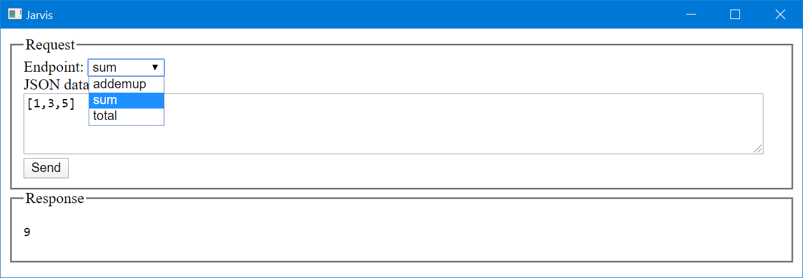

This documentation is very much a work in progress. Expected completion is Spring 2023.
# Introduction
**Jarvis** is an HTTP server that makes it easy to create a web service to provide access to your APL code from the web or a local network.

Any client program written in any language on any platform that can process HTTP requests can access  a Jarvis-based web service. This vastly increases the potential audience for your application - the client can be a standard web browser, a phone app, a browser-based app, or a custom client written in a language like Python or C# and yes, even APL.

The name **Jarvis** is a pseudo-acronym for **J**SON **a**nd **R**EST Ser**vice** ("vice" becomes "vis") and was also inspired by J.A.R.V.I.S. (Just A Rather Very Intelligent System) from the [Marvel Cinematic Universe](https://en.wikipedia.org/wiki/J.A.R.V.I.S.). 

**Formatting Note:** You may notice that the name "Jarvis" is formatted in two, possibly three, different ways:

* **Jarvis** refers Jarvis as an abstract idea
* `Jarvis` refers to the Dyalog APL Jarvis class
* Jarvis (unadorned) is probably the author's mistake for having formatted the occurrence as one of the above.

## Design Goals
**Jarvis** is designed to make it very easy for an APLer to create web services without requiring in-depth knowledge of web service frameworks. In designing **Jarvis** we've attempted to

- Make **Jarvis**' default behavior simple and applicable to many use cases
- Make few assumptions about what the user actually needs to do
- Provide hooks to allow the user to tailor or extend **Jarvis**' behavior if needed

## Create an APL Web Service in 5 Minutes
If you know how to write a monadic, result-returning APL function, you're ready to run your first **Jarvis**-based web service.  Here's how:

1. If you already have a copy of the `Jarvis` class, skip to step 3.  Otherwise, load the `HttpCommand` utility so that we can download a copy of **Jarvis** and also use `HttpCommand` for testing our web service.

              ]load HttpCommand

2. Next, download a copy of Jarvis. Note, the following statement simply downloads the latest, perhaps pre-release, version of the Jarvis class for this quick demonstration. For a production environment, you should use a [released version of Jarvis](https://github.com/Dyalog/Jarvis/releases). `HttpCommand.Fix` both downloads and runs `⎕FIX` on an APL code file from the web.

		      HttpCommand.Fix 'https://raw.githubusercontent.com/Dyalog/Jarvis/master/Source/Jarvis.dyalog

1. Write one or more monadic, result-returning APL functions. For instance:
 
              )cs #
              sum ← {+/⍵}                       ⍝ dfns work
	          total ← +/                        ⍝ derived functions work
              ⎕FX '∇r←addemup a' 'r←+/a' '∇'    ⍝ and of course, tradfns work

1. You can now run your web service running on port 8080 and serving code from the # (root) namespace.  

              (server rc)←Jarvis.Run 8080 #
	    2021/11/22 @ 15:12:06 - Conga copied from C:\Program Files\Dyalog\Dyalog APL-64 18.2 Unicode/ws/conga
        2021/11/22 @ 15:12:06 - Local Conga reference is #.Jarvis.[LIB]
        2021/11/22 @ 15:12:06 - Jarvis started in "JSON" mode on port 8080
        2021/11/22 @ 15:12:06 - Serving code in #
        2021/11/22 @ 15:12:06 - Click http://localhost:8080 to access web interface

If the server started successfully, you'll see messages similar to those above and `server` will be a reference to the server instance and the return code `rc` should be `0`.

Now, let's test our service using **Jarvis**' built-in HTML interface. You could click on the link displayed or open your favorite browser to http://localhost:8080, but just for fun, we'll use Dyalog's HTMLRenderer object.

           'h' ⎕WC 'HTMLRenderer' ('URL' 'localhost:8080')

We select the Endpoint (APL function) we want from the drop down list, enter some valid JSON data (`[1,3,5]`), and press Send to send the request to **Jarvis**.  **Jarvis**' response is then sent back and displayed.

We can also use `HttpCommand` to call the web service.

          (url data headers)←'localhost:8080/total' '[1,3,5]' ('content-type' 'application/json')
		  (HttpCommand.Do 'POST' url data headers).Data
    9

We can use the cURL command to call the web service.

    C:\> curl -H "content-type: application/json" -X POST -d [1,3,5] http://localhost:8080/addemup
    9

To stop the service, simply type `server.stop`

Interested?  Read on...